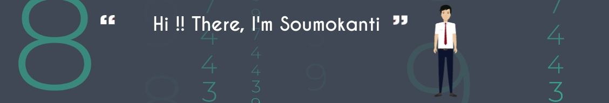

 
  

<h3 align="center">A passionate Student Software developer from India</h3>

##

<h2>This is My Video Portfolio Link(Short Animated Video):</h2>

    <a href="https://drive.google.com/file/d/13o6xiPf2lmi3BrHgmSw0ro-xCT3XD65k/view?usp=sharing" target="blank"> 
 

##

 
<h2 align='center'> Connect with me  </h2>

    <a href="https://www.facebook.com/soumo.bera.79" target="blank"> 
    
    
    

##

<h2 align='center'> Languages and Tools  </h2>

     
    
    
  
  
  
    
 
   
  
  
  
   
  
   

 
 ##
 

 <h2 align="center">My Competitive Programming Rating</h2>

 

##

 <h2 align="center">My Github Stats</h2>

|My github statistics|My languages|Streaks|
|-|-|-|
|||

<h2> Some Programming Humor for you </h2>

